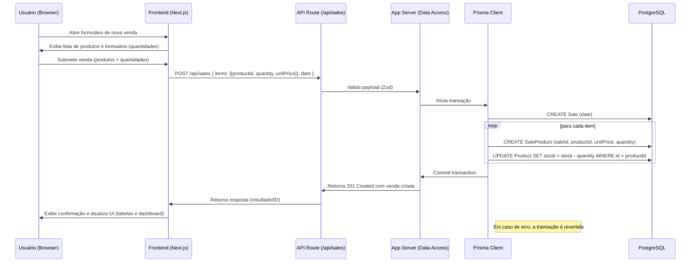

**Diagrama de sequência: Criação de Venda**

O diagrama abaixo descreve passo a passo o fluxo quando um usuário cria uma venda na aplicação.

Observações:

- A operação deve ser executada em transação para garantir consistência (criar sale + criar saleProducts + atualizar stock).
- Validação de entrada no servidor (Zod) é importante para evitar inconsistências.
